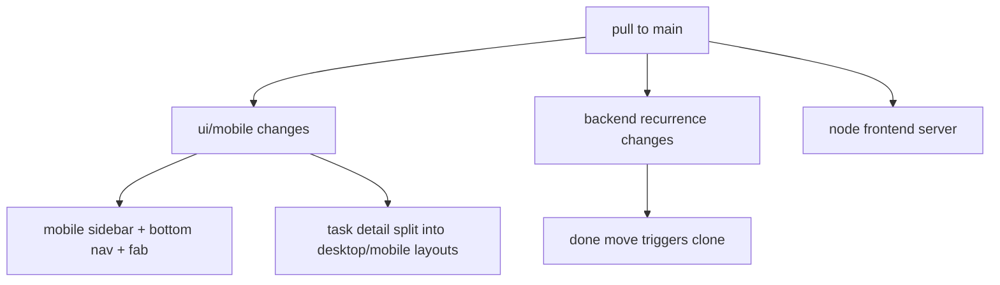
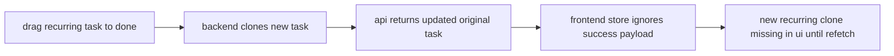

# change review 2026-03-17

## scope

reviewed pull from `e9350e0` to `c3a2484`:

1. `49aeb66` fix: modal z-index + portal render, add node.js frontend server
2. `c7a6fc5` feat: mobile version - all 11 tasks implemented
3. `c3a2484` feat: recurring tasks, activity dedup, dynamic columns, white screen fix

## shipped changes

1. backend adds recurring-task fields, migration, clone-on-done logic and activity dedup.
2. frontend adds mobile navigation, mobile task detail panel, fab quick-add, touch drag and an error boundary.
3. ops adds `frontend-server.js` as a static frontend host with `/api` proxy.

## review findings

### 1. task detail panel now renders two full copies at once

- file: `frontend/src/components/tasks/TaskDetailPanel.tsx`
- impact: duplicate ids, duplicate controls and failing tests. hidden via css is not the same as not rendered.
- evidence:
  - desktop panel at lines 102-166
  - mobile panel at lines 169-230
  - shared fields re-use fixed ids like `task-title` and `task-description` at lines 267-299
- result:
  - `frontend/src/test/TaskDetailPanel.test.tsx` now fails because `Save Changes` and the archived warning exist twice.

### 2. recurring respawn is not reflected in frontend state after drag to done

- files:
  - `backend/app/api/routes/tasks.py`
  - `frontend/src/stores/taskStore.ts`
- impact: moving a recurring task to a done column creates a clone on the server, but the board store ignores the server response and never refetches on success. users will not immediately see the new backlog task until a manual reload/refetch happens.
- evidence:
  - clone is created in `move_task` at lines 144-155
  - `moveTask` only does optimistic move and ignores the successful response at lines 91-105

### 3. weekly recurrence days are collected in the ui but ignored by scheduling logic

- files:
  - `frontend/src/components/tasks/TaskDetailPanel.tsx`
  - `backend/app/services/recurrence.py`
- impact: selecting mon/tue/etc. in the ui has no effect on the next due date. weekly recurrence always means `now + interval weeks`.
- evidence:
  - weekday picker writes `recurrence_days` at lines 384-413
  - `compute_next_due_date` never reads `recurrence_days`; weekly is hardcoded at lines 21-22

### 4. create-task path still cannot create recurring tasks

- files:
  - `frontend/src/components/kanban/AddTaskModal.tsx`
  - `frontend/src/types/index.ts`
  - `backend/app/api/routes/tasks.py`
- impact: recurring tasks can only be retrofitted after creation. the create modal exposes no recurrence controls, the create payload type has no recurrence fields, and the backend create handler discards the recurrence fields that already exist in `TaskCreate`.
- evidence:
  - create payload has no recurrence fields at `frontend/src/types/index.ts` lines 141-149
  - modal submits only title/description/priority/deadline at `frontend/src/components/kanban/AddTaskModal.tsx` lines 39-46
  - backend `create_task` only maps title/description/priority/deadline at `backend/app/api/routes/tasks.py` lines 70-78

## verification

1. `npm test` in `frontend/`
   result: passed after fixes
   details: `9` test files, `13` tests green, including new coverage for `taskStore.moveTask`.
2. `python -m pytest` in `backend/`
   result: passed after installing project dev dependencies
   details: `9` api tests green, including new recurrence-respawn coverage.
3. browser smoke test via MCP browser
   result: passed
   details: dashboard, projects and mobile project board loaded at `http://host.docker.internal:4173`; recurring task create/render path checked on mobile.

## recommended next steps

1. keep the new recurrence behavior under test when bulk-move or recurring-dashboard views are extended.
2. consider a dedicated e2e flow for "create recurring task -> move to done -> verify respawn" because that path now spans ui, store and backend.

## implemented fixes

1. task detail now renders exactly one responsive variant via `useIsMobile()` instead of two css-hidden trees.
2. successful task moves now refresh project tasks so recurring clones show up immediately.
3. weekly recurrence now respects selected weekdays in backend scheduling.
4. recurring fields are now wired through task creation as well.
5. repo-local leftovers `.claude/launch.json` and `scripts/sync_projects.py` were removed.
6. sidebar project loading now fetches once instead of being triggered by both mounted sidebar variants.

## skill integration note

planned source for codex skill import:

1. `C:\Users\matth\.claude\skills\deep-debug`
2. `C:\Users\matth\.claude\skills\gstack`
3. `C:\Users\matth\.claude\skills\notebooklm`
4. `C:\Users\matth\.claude\skills\plan-ceo-review`
5. `C:\Users\matth\.claude\skills\plan-eng-review`
6. `C:\Users\matth\.claude\skills\pm-tracker`
7. `C:\Users\matth\.claude\skills\qa`
8. `C:\Users\matth\.claude\skills\review`
9. `C:\Users\matth\.claude\skills\safe-coder`
10. `C:\Users\matth\.claude\skills\ship`
