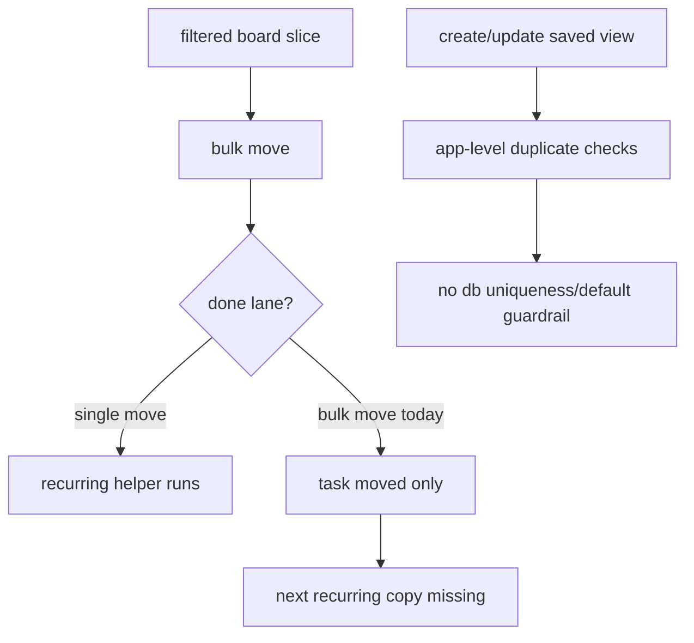

# dashboard, views and bulk-actions review 2026-03-18

## scope

review target:

1. dashboard filters and activity aggregation
2. saved project views
3. bulk task actions
4. dynamic-column adjacent board state

review basis:

1. pulled feature block from commit `c3a2484`
2. current `main`
3. review checklist categories from the local `review` skill

## findings

### 1. bulk move skips recurring-task done side effects

- severity: high
- files:
  [tasks.py](C:/Users/matth/OneDrive/Dokumente/GitHub/CMG_PM_Tool/backend/app/api/routes/tasks.py#L227)
- problem:
  the bulk `move` path repositions tasks and records activity, but it never runs the recurring-task completion behavior used by `PATCH /tasks/{id}/move`.
  moving a recurring slice into a done lane via bulk actions therefore does **not** spawn the next backlog copy.
- impact:
  the same task behaves differently depending on whether the user drags one card or uses bulk move. that is exactly the kind of inconsistency users stop trusting.
- recommendation:
  extract the done-lane side effects into a shared helper and call it from both single-task and bulk-task move flows.

### 2. saved views rely on check-then-insert logic without database guardrails

- severity: high
- files:
  [projects.py](C:/Users/matth/OneDrive/Dokumente/GitHub/CMG_PM_Tool/backend/app/api/routes/projects.py#L244)
  [models.py](C:/Users/matth/OneDrive/Dokumente/GitHub/CMG_PM_Tool/backend/app/models.py#L124)
- problem:
  view creation/update only checks for duplicate names and single-default state in application code.
  there is no db-level uniqueness on `(project_id, name)` and no guardrail that enforces exactly one default per project.
- impact:
  concurrent requests can create duplicate view names or multiple defaults, which makes the view library ambiguous and breaks the assumption that one preset owns boot behavior.
- recommendation:
  add a unique constraint for `(project_id, name)` and enforce default-view uniqueness at the database or transaction level.

### 3. bulk action target lane can drift out of sync with the active project

- severity: medium
- files:
  [BulkTaskActions.tsx](C:/Users/matth/OneDrive/Dokumente/GitHub/CMG_PM_Tool/frontend/src/components/kanban/BulkTaskActions.tsx#L25)
- problem:
  `targetColumnId` is captured once from `columns[0]` on first render and is never resynced when `projectId` or `columns` change.
- impact:
  switching projects or materially changing columns can leave the bulk move form pointed at an old or empty column id, which then fails server-side with "target column does not belong to project".
- recommendation:
  add a sync effect that resets the selection when the current column disappears or the project changes.

## remediation status

1. fixed in the current working tree on 2026-03-18
2. covered by:
   backend regression tests for recurring bulk move and project-view db constraints
   frontend regression test for bulk target-column resync on project change

## review map

## residual risk

1. dashboard filtering is functionally coherent, but it still does most filtering in python after broad selects. that is acceptable at current scale and not my main complaint.
2. the current tests cover happy paths well enough, but they do not pin the two risky cases above:
   bulk move into done for recurring tasks
   concurrent duplicate/default view creation
