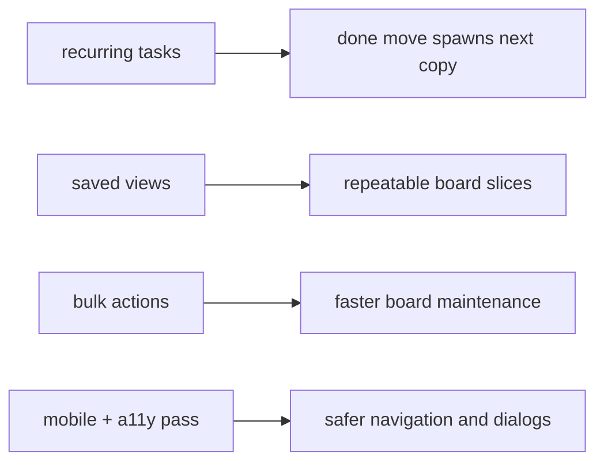

# github release text 2026-03-18

## release title

`recurring tasks, saved board views, bulk actions and mobile/a11y hardening`

## short version

this release makes the pm tool noticeably more usable day to day: recurring tasks now respawn cleanly, board slices can be saved as reusable views, bulk actions speed up board maintenance, and the mobile/navigation layer is far less fragile.

## copy-ready github text

```md
## what shipped

- recurring tasks can now carry schedule metadata and spawn the next backlog copy when a task lands in a done lane
- saved board views let you store filter slices, pin them, and set a default board preset
- bulk actions can move, reprioritize, or delete the currently filtered task slice
- dashboard filtering now applies consistently across stats, deadlines, and recent activity
- kanban columns behave better on dynamic content heights and the white-screen path is covered by an error boundary
- mobile navigation and task dialogs now expose better accessibility semantics (`aria-expanded`, `aria-current`, dialog labeling, button pressed state)

## verification

- `npm test`
- `npm run build`
- `python -m pytest`
- browser smoke checks on dashboard, projects and the mobile board

## notes

- recurring/mobile regressions were fixed after pull and pushed on top
- targeted accessibility follow-up is included in this release
```

## rollout map


