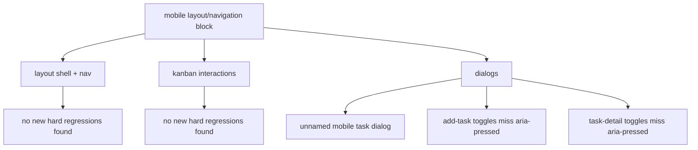

# mobile layout review

datum: 2026-03-18

## scope

- commit-block: `c7a6fc5` mobile layout/navigation
- fokus: mobile kanban, mobile dialogs, navigation, responsive layout, a11y regressions
- gelesen:
  - `frontend/src/components/layout/MainLayout.tsx`
  - `frontend/src/components/layout/Header.tsx`
  - `frontend/src/components/layout/Sidebar.tsx`
  - `frontend/src/components/layout/BottomNav.tsx`
  - `frontend/src/components/kanban/AddTaskModal.tsx`
  - `frontend/src/components/kanban/KanbanBoard.tsx`
  - `frontend/src/components/kanban/KanbanColumn.tsx`
  - `frontend/src/components/tasks/TaskDetailPanel.tsx`
  - `frontend/src/pages/KanbanPage.tsx`
  - `frontend/src/stores/uiStore.ts`
  - `frontend/src/index.css`

## findings

1. `p2` mobile task detail dialog has no accessible name
   - file: `frontend/src/components/tasks/TaskDetailPanel.tsx:113`
   - `aria-labelledby="task-detail-title"` is set on the mobile dialog, but the element with that id only exists in the desktop branch.
   - impact: screen readers get an unnamed dialog on mobile.
   - fix: render a real heading in the mobile branch or switch to `aria-label`.

2. `p3` add-task toggle groups do not expose selected state
   - file: `frontend/src/components/kanban/AddTaskModal.tsx:163`
   - priority buttons and weekly recurrence buttons are visually toggle-like, but they never expose `aria-pressed`.
   - impact: keyboard/screen-reader users cannot tell which priority or weekdays are active.
   - fix: add `aria-pressed={selected}` to each toggle button.

3. `p3` task-detail toggle groups do not expose selected state
   - file: `frontend/src/components/tasks/TaskDetailPanel.tsx:314`
   - the inline priority buttons and weekly recurrence buttons work like toggles, but they also omit `aria-pressed`.
   - impact: the current task state is not announced reliably to assistive tech.
   - fix: add `aria-pressed={selected}` for the selected/non-selected states.

## notes

- no additional functional regressions jumped out in the mobile layout/navigation block.
- the earlier sidebar double-fetch issue appears already fixed in the current tree.
- i did a code review only here, not a fresh browser pass.

## flow

