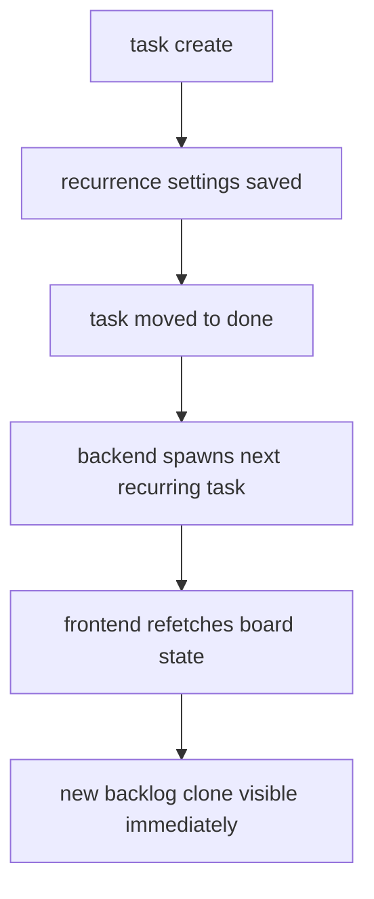

# release note 2026-03-18

## summary

this pass hardens the recurring-task flow, stabilizes the mobile board, and improves keyboard and screen-reader semantics in core navigation and task dialogs.

## shipped

1. recurring tasks now respawn correctly and refresh into the board state immediately.
2. task detail renders one responsive panel instead of duplicate desktop/mobile trees.
3. recurring task creation is wired through the add-task modal.
4. weekly recurrence respects selected weekdays.
5. mobile and desktop navigation received targeted accessibility improvements.

## accessibility pass

1. dialog semantics added to the add-task modal and task-detail panel.
2. label-to-input bindings added for core modal fields.
3. navigation buttons now expose `aria-current` where appropriate.
4. mobile menu toggle now exposes expanded/collapsed state.
5. theme toggle buttons now expose pressed state.

## verification

1. `npm test`
2. `npm run build`
3. `python -m pytest`
4. mcp browser smoke test on dashboard, projects and mobile board

## notes

1. the local browser e2e scratch project used during verification was removed again after the check.
2. the branch is ready to push after this note.
