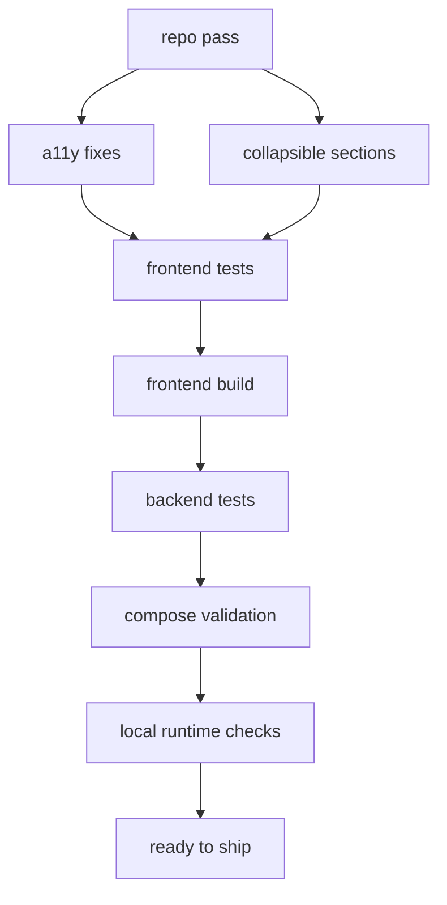

# ship readiness pass

datum: 2026-03-18

## scope

- repo-review auf dem aktuellen stand
- a11y-fixes aus dem letzten mobile/task-detail review umgesetzt
- projekt-board sektionen collapsible gemacht:
  - `// task filters`
  - `// saved views`
  - `// bulk slice ops`
  - `// label forge`
- build-, test- und deploy-readiness fuer server/agenten geprueft

## umgesetzte aenderungen

1. neue wiederverwendbare ui-basis
   - `frontend/src/components/common/CollapsiblePanel.tsx`
   - speichert collapse-state pro section in `localStorage`
   - nutzt `aria-expanded`, `aria-controls` und animiertes ein-/ausklappen

2. board-sections entschlackt
   - `frontend/src/components/common/LabelFilterBar.tsx`
   - `frontend/src/components/kanban/BulkTaskActions.tsx`
   - `frontend/src/components/projects/ProjectLabelManager.tsx`
   - `frontend/src/components/projects/ProjectViewManager.tsx`
   - `frontend/src/pages/KanbanPage.tsx`

3. a11y-regressions gefixt
   - `frontend/src/components/tasks/TaskDetailPanel.tsx`
     - mobile dialog hat jetzt einen echten namen
     - toggle-buttons expose `aria-pressed`
   - `frontend/src/components/kanban/AddTaskModal.tsx`
     - priority- und weekday-toggles expose `aria-pressed`

4. tests erweitert
   - `frontend/src/test/CollapsiblePanel.test.tsx`
   - `frontend/src/test/AddTaskModal.test.tsx`
   - `frontend/src/test/TaskDetailPanel.test.tsx`

## review-fazit

- keine neuen blocker im aktuellen repo-pass gefunden, nachdem die oben genannten a11y-funde behoben wurden
- compose-setup ist valide
- backend/frontend laufen lokal auf dem verifizierten pfad
- der vite-host-blocker fuer `host.docker.internal` ist ein lokales smoke-test-tooling-thema, kein app-fehler

## verifikation

1. frontend
   - `npm test` -> `11/11` test files, `17/17` tests gruen
   - `npm run build` -> gruen

2. backend
   - `python -m pytest` -> `11/11` tests gruen

3. deploy/runtime
   - `docker compose config` -> valide compose-ausgabe
   - `curl.exe -s http://127.0.0.1:8010/api/health` -> `{"status":"ok"}`
   - `curl.exe -s -o NUL -w "%{http_code}" http://127.0.0.1:4173` -> `200`

## push/server checklist

1. changes committen
2. auf den server ziehen
3. `docker compose up -d --build`
4. health pruefen
5. board oeffnen und collapse-state kurz gegenklicken
6. agenten wieder drauf loslassen

## flow

