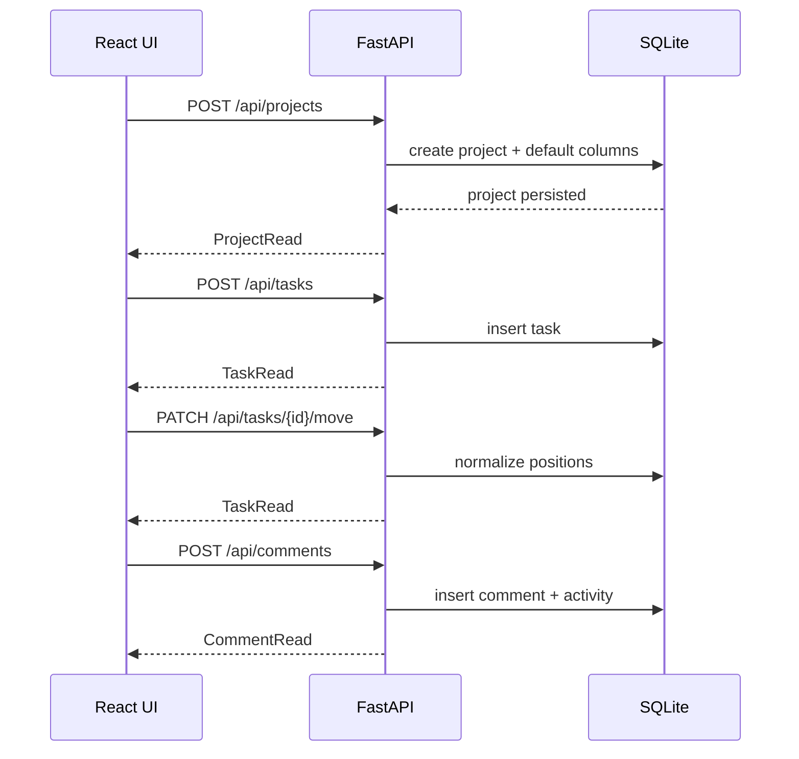

# API Overview

The frontend already expected these endpoints; the backend now implements them.

## Main Resources

1. `GET/POST /api/projects`
2. `GET/PUT/DELETE /api/projects/{project_id}`
3. `PATCH /api/projects/{project_id}/archive`
4. `PATCH /api/projects/{project_id}/restore`
5. `GET/POST /api/projects/{project_id}/columns`
6. `GET /api/projects/{project_id}/labels`
7. `GET/POST /api/projects/{project_id}/views`
8. `PUT/DELETE /api/projects/{project_id}/views/{view_id}`
9. `PATCH /api/projects/{project_id}/views/reorder`
10. `GET /api/projects/{project_id}/tasks`
11. `POST /api/projects/{project_id}/tasks/bulk`
12. `POST /api/tasks`
13. `GET/PUT/DELETE /api/tasks/{task_id}`
14. `PATCH /api/tasks/{task_id}/move`
15. `PATCH /api/tasks/reorder`
16. `GET /api/tasks/{task_id}/comments`
17. `POST/PUT/DELETE /api/comments`
18. `POST/PUT/DELETE /api/labels`
19. `POST/DELETE /api/tasks/{task_id}/labels/{label_id}`
20. `GET /api/dashboard`
21. `GET /api/dashboard/deadlines`
22. `GET /api/dashboard/activity`
23. `GET /api/dashboard/labels`
24. `GET /api/meta/runtime`

## Filter Notes

1. `GET /api/dashboard`, `GET /api/dashboard/deadlines`, and `GET /api/dashboard/activity` accept optional `label_ids`, `priorities`, and `completion` query parameters.
2. `label_ids` is a comma-separated list of label ids and matches tasks with any of those labels.
3. `priorities` is a comma-separated list of `low`, `medium`, `high`, or `urgent`.
4. `completion` accepts `all`, `open`, or `done`.
5. `GET /api/dashboard/labels` returns the active-project labels used by the frontend filter bar.
6. Column completion is derived from `column.kind=done`, so renamed done lanes still behave correctly.
7. Project views also persist `is_pinned`, `is_default`, and `position` so the frontend can render pinned rails, boot defaults, and manual ordering consistently.
8. View reordering expects the exact set of ids for the selected group (`is_pinned=true` for the pinned rail, `false` for the library).
9. Bulk task actions accept `move`, `priority`, and `delete` operations against an explicit task id slice.

## Example Flow

