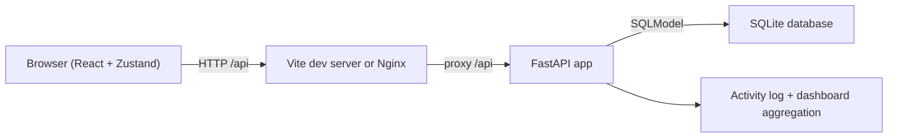
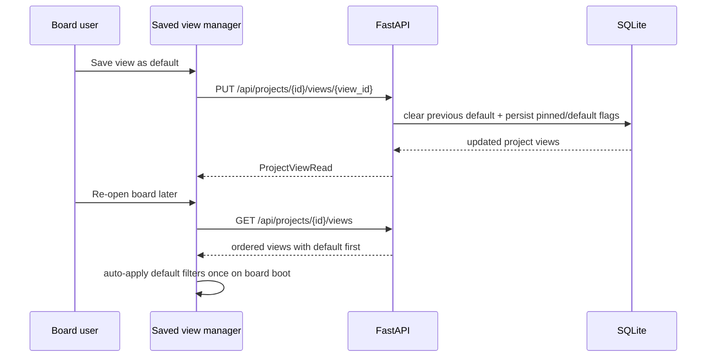

# Architecture

The app is intentionally simple: React handles the UI, FastAPI handles the API contract, and SQLite keeps persistence local and cheap.

## Notes

1. The frontend keeps existing REST contracts and relies on `VITE_API_BASE_URL`.
2. The backend runs Alembic on startup and bootstraps legacy SQLite files onto the `20260316_0001` baseline before applying newer upgrades.
3. Board completion semantics come from `column.kind=done`, not from a literal column title.
4. Project-specific saved views persist filter snapshots in SQLite and support create, rename, overwrite, pin, default-boot, manual ordering, and delete flows.
5. Toast feedback is handled in the frontend so view changes and bulk slice actions give explicit recoverable signals, including delayed-delete undo flows.
6. Bulk slice actions are routed through the backend so filtered task sets can be moved, reprioritized, or deleted consistently.
7. Archived boards stay visible in the frontend but switch all mutating controls into read-only mode before the API would reject them.
8. The backend seeds demo data on first boot when `CMG_SEED_DEMO=true`.
9. Docker deploys an Nginx frontend that proxies `/api` to the backend container.
