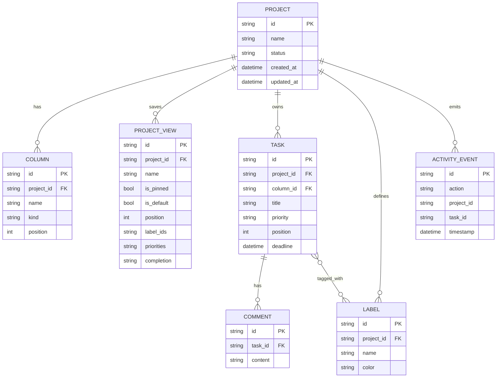

# Data Model

The backend keeps a compact domain model aimed at a single-instance LAN workflow.

## Defaults

1. New projects create `Backlog`, `In Progress`, `Review`, and `Done`, each with an explicit `kind`.
2. Project archive is soft; project delete is hard and cascades through related data.
3. Dashboard metrics treat tasks in columns with `kind=done` as completed, even if the lane is renamed.
4. Project views persist board filter snapshots per project, can be pinned, and can mark one default board boot preset.
