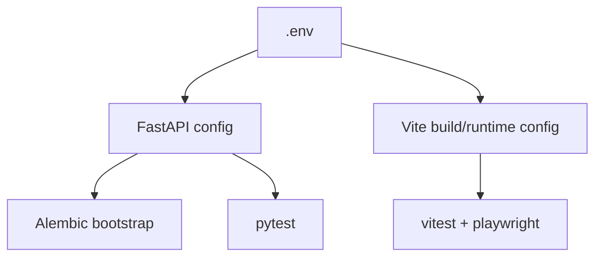

# Setup Guide

## Local Development

1. Copy `.env.example` to `.env`.
2. Start the backend from [`backend`](../backend/README.md).
3. Start the frontend from `frontend`.
4. Visit `http://localhost:5173`.

## Validation Commands

1. Backend tests: `cd backend && .\.venv\Scripts\python -m pytest`
2. Frontend tests: `cd frontend && npm run test`
3. Frontend build: `cd frontend && npm run build`
4. End-to-end tests: `cd frontend && npm run test:e2e`
5. Docker compose: `docker compose up --build`

## Migration Notes

1. Backend startup runs Alembic automatically before seeding demo data.
2. Existing SQLite files without a populated `alembic_version` row are bootstrapped to the current head once, then upgraded normally.
3. Test fixtures no longer call `create_all`; they recreate the SQLite file so Alembic is the only schema source of truth.

## LAN Notes

1. Run the frontend with `--host 0.0.0.0` so other machines can reach it.
2. Keep `CMG_CORS_ORIGINS` aligned with the LAN URL you expose.
3. The Docker frontend listens on port `4173`, the backend on `8000`.
4. For a dedicated production host, prefer the Docker path from [Mac Mini Deployment](./deployment-mac-mini.md).

